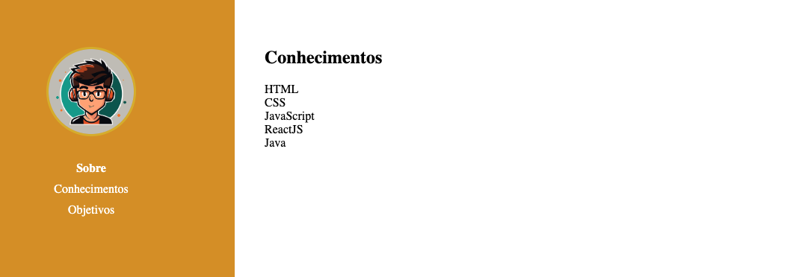
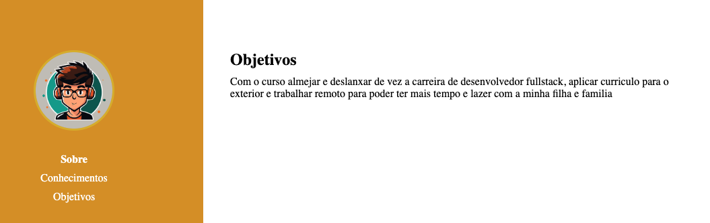

# Portifolio

Feito portifolio com navegação entre paginas, e caso queira voltar pra pagina sobre que é a pagina inicial pode ser clicado no avatar!

## Na pagina sobre

Contem informações como meu nome, endereço (ficticio), email para contato, uma breve descricao e redes sociais para poder seguir meu perfil

## Na pagina conhecimento

Contem informações sobre minhas habilidades e conhecimentos e bibliotica que ja utlizo no dia a dia

## Na pagina Objetivos

São informações do por que estou fazendo o curso da growdev e quais meus objetos ao finalizar o curso e seguir carreira na area com cada vez mais perfomance

### Tecnoligias utilizadas

Ainda de maneire bem introdutoria foram utilziadas as seguintes linguagens listadas:

- HTML
- CSS

### Qualquer duvida entrar em contato pela redes sociais

- [Linkedin](https://www.linkedin.com/in/felipe-batista-517347107/)
- [GitHub](https://github.com/felipebatista7)
- [Instagram](https://www.instagram.com/felipe_batista/)
